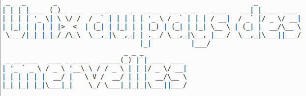

Ateliers d'initiation à l'utilisation d'un système UNIX et à la ligne de commande en général.
Ne vous laissez plus impressionner par un écran noir avec du texte dessus !

_ Une collaboration @JerryDIT × @SimplonCo _

## Informations pratiques

### Prérequis

_  Pour débutants  _

  * curiosité
  * ouverture d'esprit
  * savoir utiliser un moteur de recherche
  * comprendre un minimum l'anglais (au moins à l'écrit)

Ordinateur d'étude prêté sur place, pas besoin de ramener le votre.

### Ou ?

Simplon.co
55 Rue de Vincennes, 93100 Montreuil

[Présentation du premier atelier](http://lite3.framapad.org/p/unix+jerry@simplon.co)

